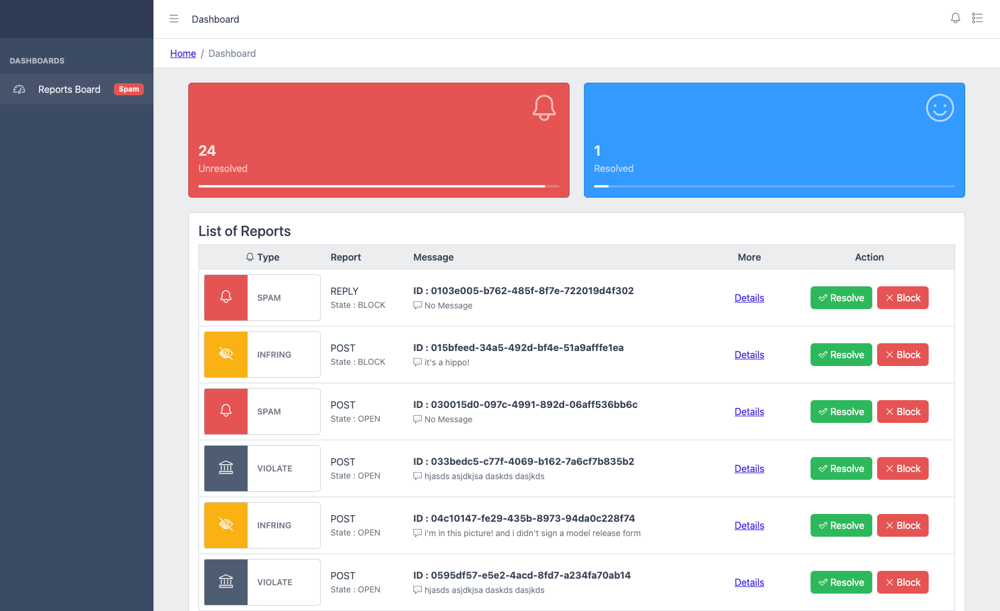
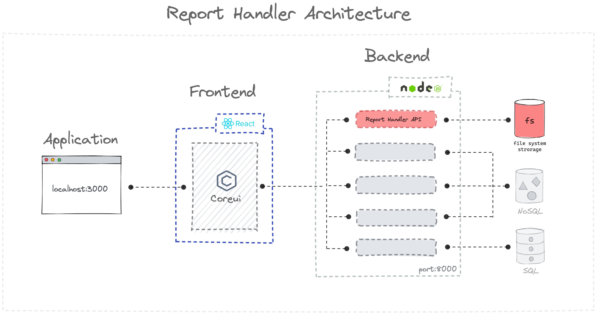

# Usage

## Report Handler (React, Node, Express, Coreui, fs) - Responsive (Mobile & Web)

### Clone Repositorie

Clone this Repositorie to your local machine

```
git clone https://github.com/eugenebelieve/report-handler.git
```
### 1 - Install Dependencies in root folder

```
npm install
```

### 2 - Install Dependencies in frontend folder

```
cd frontend
npm install
```

### 3 - Install Dependencies and run backend, inside backend folder

```
cd backend
npm install
npm run start
```


### Run application

```
# While backend is running on localhost:8000, in a new terminal window run from root folder :
npm run start
```

```
You can now view your application on localhost:3000
```

### To generate new reports data

```
# Make an API call directly from your browser to :
http://localhost:8000/newReport
```
